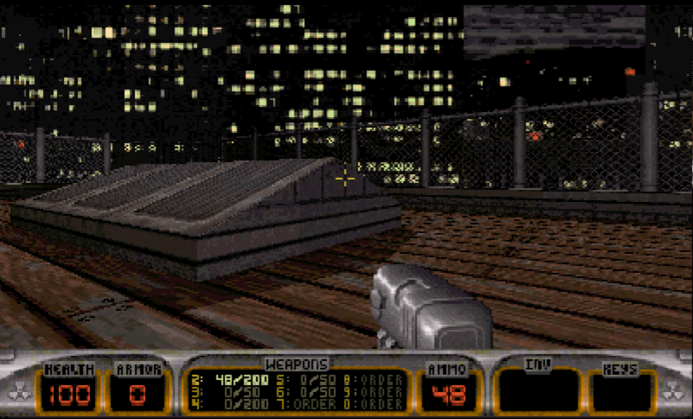

# dn3ds

Duke Nukem 3D on the New Nintendo 3DS, ported from
[the 2003 GPL source release](https://github.com/videogamepreservation/dukenukem3d).



- Runs at the top screen's native 400x240 — no scaling, and a wider field of
  view than the original 320x200.
- Touch screen is a weapon and status panel: health, armour, ammo, and a grid
  you tap to switch weapons.
- Circle pad, C-stick and the full button set, all through the game's own
  keybindings, so the in-game options menu still works.
- **Stereoscopic 3D**, driven by the console's slider 
- Ships with the v1.3D shareware episode. A registered 1.5/Atomic `DUKE3D.GRP`
  dropped in the same directory is picked up automatically.

## Install

Put all of the files from the release page on the root of your sd card, 
install `dn3ds.cia` with your CIA installer of choice. I'll eventually put 
this on universal updater

## Controls

| Button | In game | In menus |
|---|---|---|
| **Circle pad** | move / strafe (analog) | navigate |
| **D-pad** | turn, look up/down | navigate |
| **C-stick** | next / previous weapon, aim up/down | — |
| **A** / **B** | open, use · jump | select · back |
| **X** / **Y** | crouch · use inventory | — |
| **ZR** / **R** | fire | — |
| **ZL** | run | — |
| **L** | previous weapon | — |
| **START** / **SELECT** | menu · overhead map | back |
| **Touch** | tap a box to select that weapon | — |

Nothing here is hardcoded into the game logic: the 3DS pad drives
`KB_KeyDown[]`, which is what `ACTION()` and the menus already read, so
rebinding in Options still does what you expect.

## Building

Needs devkitPro with devkitARM, libctru, citro3d and `3ds-sdl`:

```sh
sudo pacman -S dkp-libs/3ds-sdl
git submodule update --init
tools/import.sh     # populate source/ from the submodules
tools/patch_sdl.py  # build the stereo-capable libSDL into vendor/sdl12-3ds/lib
make                # dn3ds.3dsx
make cia            # also dn3ds.cia (needs bannertool + makerom from the AUR)
```

```sh
tools/make_assets.py      # regenerate icon/banner/banner audio from the GRP
```

## How the port is put together

The portable C layer comes from
[chocolate_duke3D](https://github.com/fabiensanglard/chocolate_duke3D), a
faithful translation of this same v1.5 source — `draw.c` for A.ASM,
`fixedPoint_math.c` for PRAGMAS.H, `control.c` and `keyboard.c` for the
missing MACT. That it really is the same code is checked rather than assumed:
`tools/verify_provenance.sh` compares every game file against
`vendor/dukenukem3d` and reports 92–99% symbol overlap.

Everything 3DS-specific is in `source/n3ds/`:

| | |
|---|---|
| `platform_n3ds.c` | pre-`main` setup: game directory, log redirection, `args.txt` |
| `input_n3ds.c` | pad and stick → `KB_KeyDown[]` and `ControlInfo` |
| `bottom_n3ds.c` | the touch panel |
| `dsl_n3ds.c` | audiolib's output driver, over SDL audio onto NDSP |
| `stereo_n3ds.c` | the right-eye render pass |
| `stubs_n3ds.c` | netplay and music, deliberately inert |
| `n3ds_compat.h` | the newlib/POSIX shims |


## Known limitations

- **No music.** MIDI needs a synth on the ARM11, which is its own project.
  `MUSIC_*` is stubbed.
- **No multiplayer.** `mmulti` is not built; the netplay entry points are
  inert stubs.


## Stereoscopic 3D

Driven by the console's 3D slider. At zero the second render pass is skipped
entirely, the driver drops back to mono and frees its right-eye target, and
the game costs exactly what it did before. Eye separation is 96 Build units at
full slider — a doorway is on the order of 1024 units, so if that is roughly a
metre then real 65mm separation is about 66 units, and this sits a little above
life size bc i liked how it looked better that way :3

## Licence and credits

The engine and game code are GPLv2, per the 2003 release — see `GNU.TXT` in
`vendor/dukenukem3d`. The port layer in `source/n3ds/` is GPLv2 to match.

`gamedata/` contains the Duke Nukem 3D v1.3D **shareware** episode. "Duke
Nukem" is a registered trademark of Apogee Software, Ltd.; the data files are
copyright 3D Realms and are *not* covered by the GPL. They are included here
under the shareware distribution terms. The icon and banner are generated from
tiles in that data by `tools/make_assets.py`.

- [devkitARM / libctru](https://github.com/devkitPro/libctru) and
  [SDL 1.2 for 3DS](https://github.com/devkitPro/SDL)
- [chocolate_duke3D](https://github.com/fabiensanglard/chocolate_duke3D) by
  Fabien Sanglard, for the C translation of the assembly and MACT layers
- Ken Silverman's Build engine, and 3D Realms for releasing the source
  (You guys are awesome!)
